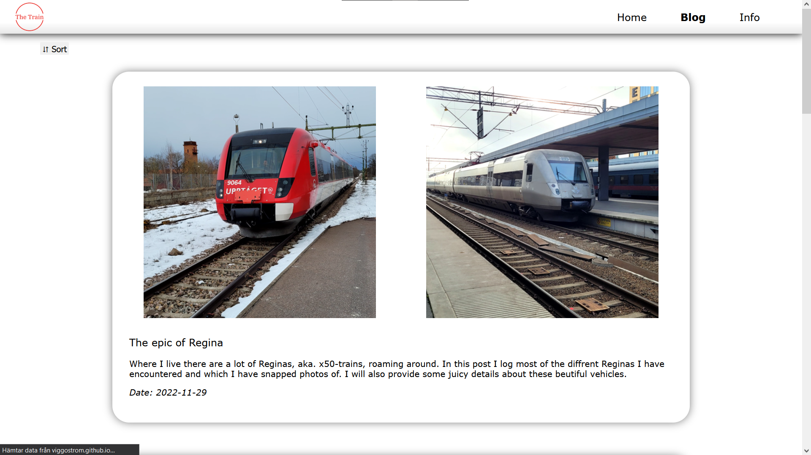

# My Train Blog Website

Hosted via [GitHub Pages](https://viggostrom.github.io/Train-Blog-Website/).

## Description
This is my train blog that I made as a project for the *web development 1* course I took at NTI Gymnasiet, Uppsala. The website is made with HTML, CSS and JavaScript. It is a simple blog where you can read posts about trains.

## Technologies
- HTML
- CSS
- JavaScript